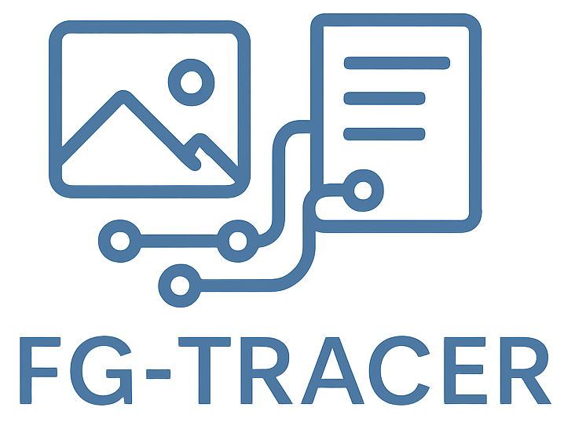
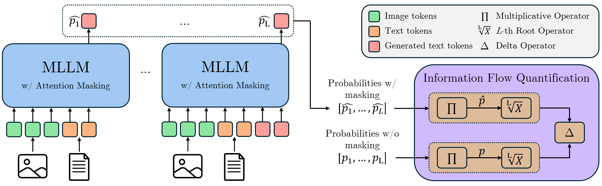

<p align="center">
    
<p>

<h3 align="center"><a href="https://iris.unimore.it/handle/11380/1390068" style="color:#D2691E">
FG-TRACER: Tracing Information Flow in Multimodal Large Language Models in Free-Form Generation</a></h3>

We release **FG-TRACER**, a novel framework designed to analyze the information flow between visual and textual modalities in Multimodal Large Language Models (MLLMs) in free-form generation. While prior works mainly focused on short-answer VQA, FG-TRACER introduces a numerically stabilized computational method that enables a systematic analysis of multimodal information flow in underexplored domains such as image captioning and chain-of-thought (CoT) reasoning.

This repository includes all materials necessary to reproduce our framework across three diverse datasets—TextVQA for text understanding, COCO 2014 for image captioning, and ChartQA for chart understanding—on three publicly available models, namely [LLaVA 1.5](https://github.com/haotian-liu/LLaVA),
[LLaMA 3.2-Vision](https://github.com/meta-llama/llama-models), and [Qwen 2.5-VL](https://github.com/QwenLM/Qwen3-VL).

## 📑 Contents
- [Overview](#-overview)
  - [Introduction](#introduction)
  - [Key Features](#key-features)
  - [FG-TRACER Framework](#fg-tracer-framework)
- [Models](#%EF%B8%8F-models)
- [Installation](#%EF%B8%8F-installation)
- [Datasets](#%EF%B8%8F-datasets)
- [Method](#-method)

## 📜 Overview 
### Introduction
FG-TRACER is a framework designed to analyze how information flows between visual and textual modalities in Multimodal Large Language Models (MLLMs) during free-form generation tasks— such as image captioning or chain-of-thought (CoT) reasoning.

The core idea is to iteratively mask attention between specific target and source token groups across selected layers and measure the information flow as the change in output probability, where significant deviations indicate that the intervention disrupted a critical information pathway. This approach provides new insights into how MLLMs fuse multimodal information throughout the generation process.

### Key Features
* **🧠 Numerically stabilized formulation**: Introduces a normalization method based on the sequence length to ensure robust probability estimation in long, free-form outputs.

* **📊 Attention masking mechanism**: Selectively blocks communication between token groups (image ↔ text, text ↔ last token, etc.) to isolate their individual contributions.

* **🧩 Multi-model and multi-task support**: Compatible with leading MLLMs — LLaVA 1.5, LLaMA 3.2-Vision, Qwen 2.5-VL — across tasks like TextVQA, COCO 2014 captioning, and ChartQA reasoning.

* **📈 Word-level multimodal analysis**:  Our word-level analysis in image captioning and CoT reasoning, showing that terms expressing spatial, temporal, contextual, or procedural relations exhibit strong visual grounding.

### FG-TRACER Framework

  <figcaption><em><!--Overview of the FG-TRACER framework. 
  For each output token, FG-TRACER computes the probabilities of the correct answer tokens with and without attention masking applied— and , respectively—between selected token groups across a window of layers. The token-level probabilities  and  are then multiplied, and normalized via the L-th root, where L is the answer token length, to avoid length-induced distortions. 
  The information flow between the selected token groups is then quantified as the relative change in output probabilities () between the normalized probabilities computed with and without the attention masking. --></em></figcaption>
</figure>

FG-TRACER analyzes the inner mechanisms of multimodal large language models in two main steps:

#### 1. Attention Masking
FG-TRACER intervenes on **multi-head attention** layers of a multimodal LLM by selectively masking specific connections inside the model.
By seeing how much the model’s output changes when a connection is blocked, we can tell how important that connection was.

#### 2. Measuring Information Flow
For an answer of length $L$, let $p_i$ be the original probability of token $i$ and $\hat{p}_i$ the probability after masking.  
The sequence probabilities are computed as:

<p align="center">
  
</p>

To avoid exponential distortion on long outputs, FG-TRACER **length-normalize** sequance probabilities via the $L$-th root and compute the information flow as:

<p align="center">
  
</p>

$\Delta$ reflects true per-token influence, making results **robust and comparable** across different answer lengths.

## 🏛️ Models 
We evaluate FG-TRACER on three publicly available MLLMs: 
| Model    | Size    |  Download    |    
|----------|-------------|----------|
| LLaVA 1.5       | 13B  | [link](https://github.com/haotian-liu/LLaVA/blob/main/docs/MODEL_ZOO.md)
| LLaMA 3.2-Vision| 11B  | [link](https://huggingface.co/meta-llama/Llama-3.2-11B-Vision)      
| Qwen 2.5-VL     | 7B   | [link](https://huggingface.co/Qwen/Qwen2.5-VL-7B-Instruct)

Before running this project, you need to set in the `config.json` file of LLaMA-3.2-Vision and Qwen 2.5-VL this configuration:
```
"_attn_implementation": "eager"
```

## 🛠️ Installation
Clone this repository into a local folder. 
```
git clone https://github.com/aimagelab/FG-TRACER.git
cd FG-TRACER
```
Create a python env for the specific MLLM model you want to evaluate and activate it. 
```bash
conda create -n llava python=3.10.18
conda activate llava
cd LLaVA
pip install -r requirements.txt
```

```bash
conda create -n llama python=3.10.18
conda activate llama
cd LLaMAVision
pip install -r requirements.txt
```

```bash
conda create -n qwen_vl python=3.10.18
conda activate qwen_vl
cd Qwen2.5_VL
pip install -r requirements.txt
```

## 🗂️ Datasets
| Task | Dataset    | Download    |
|---------------------------------------|-------------|-------------|
| Text Understanding | TextVQA    | [link](https://textvqa.org/dataset/)  
| Image captioning | COCO2014  | [link](https://cocodataset.org/#home) 
| Chart Understanding    | ChartQA | [link](https://huggingface.co/datasets/HuggingFaceM4/ChartQA)

## ⚙️ Method
### - Run FG-TRACER Experiments
To analyze attention information flow, run the following scripts inside the model-specific folders:
 - `coco_with_attention_blocking`
 - `textvqa_with_attention_blocking`
 - `chartqa_with_attention_blocking.py` 

#### Command format:
```
python <script_name>.py \
  --checkpoint_dir <MODEL_PATH> \      # Path to model checkpoint
  --image_dir <IMAGE_DIR> \            # Directory containing image files
  --block_types <BLOCK_TYPE> \         # Attention pathway to block
  --k <K_VALUE> \                      # Window size K
  --answer_path <ANSWER_PATH>          # Path to output folder 
```

`<BLOCK_TYPE>` can be chosen from:
```
"last_to_last"
"question_to_last"
"image_to_last"
"image_to_question"
"full_attention"
```

For each model, the folder `tracing_information_flow/dataset/` contains the JSON file with the correct samples used in our experiments. We also provide a separate JSON file with the incorrect samples used for the ablation study.
If you want to generate your own JSON files, please follow the instructions below. 
After generating it, make sure to set the `--data_path` argument in the script to point to your newly created file. This will ensure that the experiments run using your custom dataset.


### - If you want to re-create the datasets used for the analysis
#### Step1: Evaluate the Model 
To reproduce the evaluation datasets, run the appropriate scripts in each dataset’s model-specific folder:

TextVQA:
```
python textvqa.py \
  --checkpoint_dir <MODEL_PATH> \              # Directory for the checkpoint of the model
  --image_dir <IMAGE_DIR> \                    # Directory containing the images
  --data_path <ANNOTATION_PATH> \              # Path to the annotation json file
  --answer_path  <ANSWER_PATH> \               # Path to the answer json file
```

ChartQA:
```
python chartqa.py \
  --checkpoint_dir <MODEL_PATH> \                     # Directory for the checkpoint of the model
  --image_dir <IMAGE_DIR> \                           # Directory containing the images
  --data_human_path <DATA_PATH> \                     # Path to the annotation json file
  --data_augmented_path <DATA_AUGMENTED_PATH> \       # Path to the annotation json file
  --answer_path  <ANSWER_PATH> \                      # Path to the answer json file
```

COCO:
```
python coco.py \
  --checkpoint_dir <MODEL_PATH> \              # Directory for the checkpoint of the model
  --image_dir <IMAGE_DIR> \                    # Directory containing the images
  --data_path <ANNOTATION_PATH> \              # Path to the annotation json file
  --answer_path  <ANSWER_PATH> \               # Path to the answer json file
```

#### Step2: Check Correcly Predicted Samples
To create datasets with the model's correctly predicted answers, run the evaluation scripts below:
- `eval/eval_chartqa.py`
- `eval/eval_coco.py` 
- `eval/eval_textvqa.py`

Use the following formats to run each script: 

ChartQA:
```
python eval/eval_chartqa.py \
  --input <RESULT_JSON_PATH> \          # Path to the model result JSON file
  --output <CORRECT_JSON_PATH>          # Path to save the filtered correct answers
```

COCO:
```
python eval/eval_coco.py \
  --annotation <ANNOTATION_PATH> \      # Path to the COCO annotation file (e.g., captions_val2014.json)
  --results <RESULT_JSON_PATH> \        # Path to the model results JSON file
  --ids_output <OUTPUT_JSON_PATH>       # Path to save the correct image IDs
```

TextVQA:
```
python eval/eval_textvqa.py \
  --results <RESULT_JSON_PATH> \        # Path to the model result JSON file
  --correct_out <CORRECT_JSON_PATH> \   # Path to save correctly predicted samples
  --wrong_out <WRONG_JSON_PATH>         # Path to save incorrectly predicted samples
```

#### Step3: Build Final Datasets
To generate the final datasets used for the information flow analysis, inside the model-specific folders run the following scripts:
- `tracing_information_flow/create_chartqa.py`
- `tracing_information_flow/create_coco.py` 
- `tracing_information_flow/create_textvqa.py` 

Before running these scripts, make sure to set the correct paths at the top of each file. The final datasets will be created inside the corresponding subfolders in:
```
tracing_information_flow/dataset/
```

### - Plot the information flow
To compute the information flow of the generated free-form answer, run the script `plot_information_flow.py`. Before running the script, set the paths. This script loads FG-TRACER outputs and visualizes information flow across models, and datasets.
It generates several PDF figures (e.g., general information flow, window-size K ablations, and correct vs. wrong predictions) to support the analysis presented in the paper.

### - Word-level analysis
To reproduce our word level analysis, run the script `word_analysis.py`. Before running the script, set the paths.
This script performs a word-level analysis of information flow for LLaMA-Vision, Qwen2.5-VL and LLaVA on COCO and ChartQA. For each correctly answered sample, it aggregates token-level probabilities into per-word measures, normalizing over subwords and computes per-word information flow. These word-level scores are accumulated across the dataset, and filtered by frequency and impact to find the most visual grounding words and the less ones. Finally, the script plots the layer-wise probability change curves for selected words for LLaMA-Vision for our ablation study.

## 📚 References
* [Improved Baselines with Visual Instruction Tuning](https://github.com/haotian-liu/LLaVA)
* [The Llama 3 Herd of Models](https://github.com/meta-llama/llama-models)
* [Qwen2.5-VL Technical Report](https://github.com/QwenLM/Qwen3-VL)
* [Microsoft COCO Caption Evaluation](https://github.com/tylin/coco-caption)

## 🔗 Citing our work
If you find this code and paper useful for your research, please kindly cite our paper.
```
@inproceedings{saporita2026fgtracer,
  title     = {FG-TRACER: Tracing Information Flow in Multimodal Large Language Models in Free-Form Generation},
  author    = {Saporita, Alessia and Pipoli, Vittorio and Bolelli, Federico and Baraldi, Lorenzo and Acquaviva, Andrea and Ficarra, Elisa},
  booktitle = {Proceedings of the IEEE/CVF Winter Conference on Applications of Computer Vision (WACV)},
  year      = {2026},
  address   = {Tucson, Arizona, USA}
}
```

